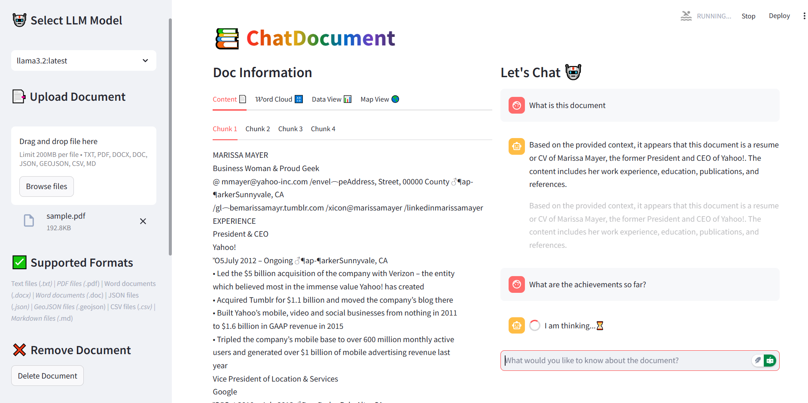
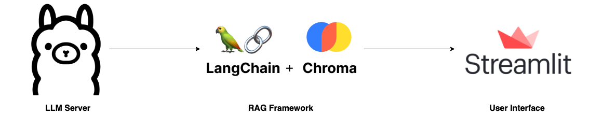
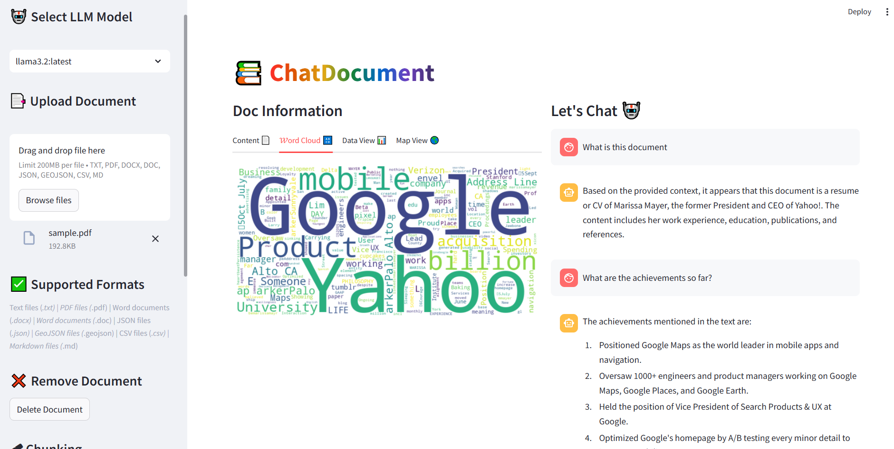

# ChatDocument



Local RAG (Retrieval Augmented Generation) application that allows you to chat with your documents such as any document such as `.txt`, `.pdf`, `.md`, `.docx`, `.doc`, `.json` (including `.geojson`) using Ollama LLMs and LangChain via a Streamlit Web UI for Q&A interaction.

## 📚 RAG System Architecture

 

## 📂 Project Structure

```
.
├── .streamlit/
│   └── config.toml       # Streamlit configuration (OPTIONAL)
├── assets/
│   └── ui.png            # Streamlit UI image
├── components/
│   ├── __init__.py
│   ├── chat.py           # Chat interface implementation
│   └── upload.py         # Document upload handling
├── core/
│   ├── __init__.py
│   ├── embeddings.py     # Vector embeddings configuration
│   └── llm.py            # Language model setup
├── data/
│   ├── vector_store/     # ChromaDB vector store for embeddings
│   └── sample_docs/      # Sample documents for testing
├── utils/
│   ├── __init__.py
│   └── helpers.py        # Utility functions
└── main.py               # Application entry point
```

## 🚀 Getting Started

### 1. **Install Ollama**

- Visit [Ollama's website](https://ollama.com) to download library and install
- Open `cmd` or `terminal` and run `ollama` to check the installation

- Pull required models:

  ```bash
  ollama pull llama3.2  # or your preferred model
  ollama pull nomic-embed-text
  ```

- Pull (or run) deepseek model:

  ```bash
  ollama run deepseek-r1:8b
  ```

- Check the list of locally available ollama models:
  ```bash
  ollama list
  ```

### 2. **Clone Repository**

- Open `cmd` or `terminal` to clone repository and run the following commands:

  ```bash
  https://github.com/aghoshpro/ChatDocumentRAG.git
  ```

- Create a working directory and navigate to it:
  ```bash
  cd ChatDocumentRAG
  ```

### 3. **Set Up Local Environment**

- Create a virtual environment `myvenv` and activate it:

  ```bash
  python -m venv myvenv
  ```

  ```bash
  .\myvenv\Scripts\activate    # On Windows

  # ---------------------- OR ---------------------- #

  source myvenv/bin/activate  # On Linux or Mac
  ```

- Install dependencies:
  ```bash
  pip install -r requirements.txt
  ```

## 🎮 Run Streamlit Web App

```bash
streamlit run main.py
```

- Content View
  

- WordCloud View:
  

## ✨Theme Configuration

- Create `.streamlit/config.toml` with:

  ```toml
  [theme]
  primaryColor = "#FF4B4B"
  backgroundColor = "#FFFFFF"
  secondaryBackgroundColor = "#F0F2F6"
  textColor = "#262730"
  font = "sans serif"
  ```

## 📑 References

- [LangChain](https://python.langchain.com/docs/index.html)
- [Ollama](https://ollama.com/docs/index.html)
- [ChromaDB](https://www.trychroma.com/)
- [Streamlit](https://docs.streamlit.io/)
- [Folium](https://python-visualization.github.io/folium/)
- [Unstructured](https://docs.unstructured.io/platform/supported-file-types)
- [Enhancing Retrieval Augmented Generation with ChromaDB and SQLite](https://medium.com/@dassandipan9080/enhancing-retrieval-augmented-generation-with-chromadb-and-sqlite-c499109f8082)
- [Implementing RAG in LangChain with Chroma](https://medium.com/@callumjmac/implementing-rag-in-langchain-with-chroma-a-step-by-step-guide-16fc21815339)

- [Build Your Own RAG and Run Them Locally](https://blog.duy.dev/build-your-own-rag-and-run-them-locally/)
