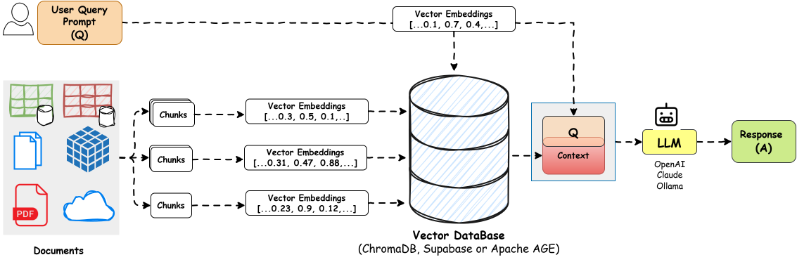

# ChatDocument


Retrieval Augmented Generation (RAG) application that allows you to chat with any of your local documents in disparate formats e.g., `.txt`,`.pdf`, `.md`, `.docx`, `.doc`, `.json`,`.geojson` using Ollama LLMs and LangChain. Upload your document in the Streamlit Web UI for Q&A interaction. Have fun

## 📂 Project Structure

```
├── .streamlit/
│   └── config.toml       # Streamlit configuration (OPTIONAL)
├── assets/
│   └── ui.png            # Streamlit UI image
├── components/
│   ├── __init__.py
│   ├── chat.py           # Chat interface implementation
│   └── upload.py         # Document upload handling
├── core/
│   ├── __init__.py
│   ├── embeddings.py     # Vector embeddings configuration
│   └── llm.py            # Language model setup
├── data/
│   ├── vector_store/     # To store vector embeddings in chromadb
│   └── sample_docs/      # Sample documents for testing
├── utils/
│   ├── __init__.py
│   └── helpers.py        # Utility functions
└── main.py               # Application entry point
```

## 📚 RAG Architecture




## ✨ Features

- 📄 Multi document (`.txt`, `.pdf`, `.md`, `.docx`, `.doc`, `.json`) processing with intelligent chunking
- 🧠 Multi-query retrieval for better context understanding
- 🎯 Advanced RAG implementation using LangChain and Ollama
- 🔒 Complete local data processing - no data leaves your machine
- 📓 Jupyter notebook for experimentation
- 🖥️ Clean Streamlit UI

## 🚀 Getting Started

### 1. **Install Ollama**

- Visit [Ollama.ai](https://ollama.com) to download Ollama and install

- Open `cmd` or `terminal` and run `ollama`

- Install LLM models (locally):

- Start with `ollama pull llama3.2` as it's low sized (4GB) basic llm model tailored for general usecases

- For vector embeddings pull the following,

  ```bash
  ollama pull mxbai-embed-large # or `nomic-embed-text`
  ```

- Chat with the model in `terminal`,

  ```bash
  ollama run llama3.2   # or your preferred model
  ```

- Go to [Ollama Models](https://ollama.com/search) to search and pull other famous models as follows,

  ```bash
  ollama pull dolphin3
  ollama pull deepseek-r1:8b
  ollama pull mistral
  ```

- Check the list of locally available ollama models:

  ```bash
  ollama list
  ```

### 2. **Clone Repository**

- Open `cmd` or `terminal` and navigate to your preferred directory, then run the following,

  ```bash
  git clone https://github.com/aghoshpro/ChatDocument.git
  ```

- Go to the ChatDocument folder using `cd ChatDocument`

### 3. **Set Up Local Environment**

- Create a virtual environment `myvenv` inside the `./ChatDocument` folder and activate it:

  ```bash
  python -m venv myvenv
  ```

  ```bash
  # Windows
  .\myvenv\Scripts\activate    # OR source myvenv/bin/activate (in Linux or Mac)
  ```

- Install dependencies:

  ```bash
  pip install --upgrade -r requirements.txt
  ```
  
- 🧪 Experiment with code in `*.ipynb`

  ```sh
  jupyter notebook
  ```

## 🕹️ Run

```bash
streamlit run main.py
```

- Select `llama3.2` as the model and start chatting.

- Content View
  

- WordCloud View:
  

## 🛠 Troubleshooting

- Ensure Ollama is running in the background
- GPU preferred for good performance if not CPU (will be slower)
- `./data/sample_docs` contains few sample documents for you to test
- Use `pip list` or `pip freeze` to check currently installed packages
<!-- - Delete `./data/vector_store/` that holds embeddings in case delete file option failed to delete docs. -->

## ✨Theme Configuration

- Edit `.streamlit/config.toml` for your color preferences

  ```toml
  [theme]
  primaryColor = "#FF4B4B"
  backgroundColor = "#0E1117"
  secondaryBackgroundColor = "#262730"
  textColor = "#FAFAFA"
  font = "sans serif"
  ```

## 🤝 Contributing

- Open issues for bugs or suggestions
- Submit pull requests

## 📑 References

### Docs

- [LangChain](https://python.langchain.com/docs/index.html)
- [Ollama](https://ollama.com/docs/index.html)
- [ChromaDB](https://www.trychroma.com/)
- [Streamlit](https://docs.streamlit.io/)
- [Folium](https://python-visualization.github.io/folium/)
- [Unstructured](https://docs.unstructured.io/platform/supported-file-types)
- [ChromaDB Tutorial Step by Step Guide](https://www.datacamp.com/tutorial/chromadb-tutorial-step-by-step-guide)
- [ChromaDB Collections](https://docs.trychroma.com/docs/collections/create-get-delete)

### Blogs

- [Finding the Best Open Source Embedding Model for RAG](https://medium.com/timescale/finding-the-best-open-source-embedding-model-for-rag-929d1656d331)
- [Enhancing Retrieval Augmented Generation with ChromaDB and SQLite](https://medium.com/@dassandipan9080/enhancing-retrieval-augmented-generation-with-chromadb-and-sqlite-c499109f8082)
- [Implementing RAG in LangChain with Chroma](https://medium.com/@callumjmac/implementing-rag-in-langchain-with-chroma-a-step-by-step-guide-16fc21815339)
- [Build Your Own RAG and Run Them Locally](https://blog.duy.dev/build-your-own-rag-and-run-them-locally/)

### Stack Overflow

- [Langchain Ollama Module Difference](https://stackoverflow.com/questions/78921530/langchain-ollama-module-difference)
